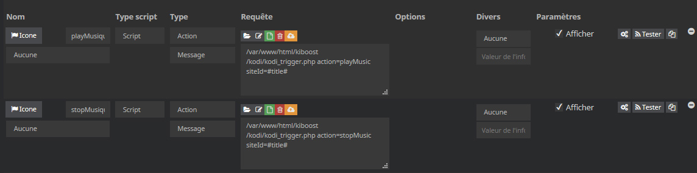
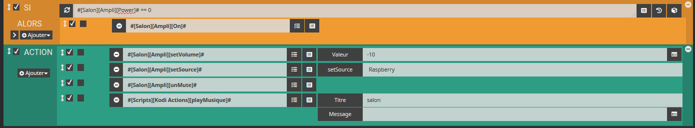

# php Kodi json API - Jeedom

## Utilisation avec Jeedom


Voici un exemple d'utilisation de *[php Kodi json API](https://github.com/KiboOst/php-Kodi-jsonAPI)* avec Jeedom.

L'objectif consiste à pouvoir interagir avec Kodi (installé sur un raspberry par exemple) pour lancer de la musique, régler le volume etc à partir du dashboard ou d'un scénario.
Je ne détaillerai par tout ce qu'on peux faire mais une fois que vous aurez compris au travers de quelques exemples, vous pourrez utiliser toutes les fonctions de l'API avec la puissance de Jeedom. Je l'utilise par exemple pour demander à SNIPS de mettre du Jazz, du mettre moins fort, etc. SNIPS est aussi capable de couper le son quand il est trop fort et que je lui demande quelque chose, puis de remettre le son ensuite etc. A vous d'adapter suivant vos souhaits.

Cela va consister à:
- Télécharger *php Kodi json API* sur votre Jeedom.
- Créer un Script avec commandes nécessaires.
- Créer un scénario déclenchant ces commandes.

Il vous faudra pour çà deux plugins, gratuits:
- Le plugin JeeXplorer
- Le plugin Script

## Télécharger *php Kodi json API* sur votre Jeedom

- Récupérez le fichier [phpKodi-api.php](https://github.com/KiboOst/php-Kodi-jsonAPI/blob/master/class/phpKodi-api.php "phpKodi-api.php")
- Sur votre Jeedom, avec le plugin JeeXplorer, créez un dossier kiboost et un sous dossier Kodi à la racine, et mettez le phpKodi-api.php dedans.

> Vous pouvez mettre le fichier où bon vous semble. Dans cet exemple, son chemin sera donc html/kiboost/Kodi/phpKodi-api.php

- Dans le même répertoire, créez un nouveau fichier txt et renommez le *kodi_trigger.php*. C'est ce fichier qui sera appelé par le plugin Script, et qui contiendra les fonctions que vous souhaitez.

## Création du Script

- Rien de compliqué ici, Plugins/Programmation/Script, puis créez un Script en cochant *Activer* (et *Visible* pour l'afficher sur le dashboard, avec le bon parent). Ici il aura pour nom Kodi Actions et pour parent Maison.

- Dans l'onglet *Commandes*, créez deux nouvelles commandes de type Script, Action, Message. Nommez les *playMusique* et *stopMusique* :


<p align="center"></p>

Pour la commande *playMusique*, mettez comme requête : /var/www/html/kiboost/kodi/kodi_trigger.php action=playMusic siteId=#title#
Pour la commande *stopMusique*, mettez comme requête : /var/www/html/kiboost/kodi/kodi_trigger.php action=stopMusic siteId=#title#

Vous venez donc de créer un équipement Script, avec deux commandes actions. Les deux actions appellent le même fichier kodi_trigger.php, mais chaque commande lui passe sa propre action. On va voir pourquoi ci-dessous. La deuxième variable, siteId, vous permet de stipuler à quel Kodi vous voulez adresser la commande. Elle n'est pas obligatoire et si vous n'avez qu'un seul Kodi, ne la mettez pas.

Voici un exemple d'appel par scénario :

<p align="center"></p>

Ici une scénario assez simple. On check si l'ampli est allumé, puis on règle le volume, la source, unmute et enfin on lance notre action *playMusique*.
Dans ce scénario, l'ampli est géré de la même façon, avec un Script et une autre API [php-NADC338](https://github.com/KiboOst/php-NADC338) gérant un ampli NAD disposant du wifi. Avec un Kodi disposant d'une carte HifiBerry, on a du bon son !

Maintenant, voyons le fichier où beaucoup de choses vont se passer : *kodi_trigger.php*

Dans ce fichier, vous allez reprendre les fonctions des commandes que vous avez créées.

```php
<?php
include('phpKodi-api.php');
include('/var/www/html/core/class/scenario.class.php');

if (isset($argv)) {
	foreach ($argv as $arg) {
		$argList = explode('=', $arg);
		if (isset($argList[0]) && isset($argList[1])) {
			$_GET[$argList[0]] = $argList[1];
		}
	}
}
$IP = '192.168.1.18';
$action = 'default';

if(isset($_GET['IP'])) $IP = $_GET['IP'];
if(isset($_GET['siteId']))
{
  $siteId = $_GET['siteId'];
  if ($siteId == 'salon') $IP = '192.168.1.18';
  if ($siteId == 'chambre') $IP = '192.168.1.19';
}
if(isset($_GET['action'])) $action = $_GET['action'];

//===========initialize API:
$_Kodi = new Kodi($IP);
if (isset($_Kodi->error))
{
    $error = $_Kodi->error;
  	$msg = date('H:i:s', time()).' : '.$error;
  	message::add('Kodi trigger', $msg);
}
else
{
    if ($action != 'default') call_user_func($action);
}

//===========functions:
function playMusic()
{
  global $_Kodi;
  $_Kodi->stop();
  $_Kodi->setVolume(34);
  $_Kodi->clearPlayList();
  $_Kodi->loadPlaylist('special://profile/playlists/music/iJazz.xsp');
  $_Kodi->play();
  $_Kodi->setShuffle(true);
  $_Kodi->setMute(false);
  $_Kodi->setRepeat('all');
}

function stopMusic()
{
  global $_Kodi;
  $_Kodi->stop();
  $_Kodi->setVolume(34);
  $_Kodi->setRepeat('off');
  $_Kodi->clearPlayList();
}

?>
```
- Au début du fichier php, on charge l'API, et les commandes de scénarios de Jeedom, qui serviront éventuellement à signaler un problème.
- Ensuite, on récupère tout les arguments passés au script
- On définit l'IP de notre Kodi. Celle-ci sera l'IP par défaut si on n'en spécifie pas.
- On définit une action par défaut pour initialiser la variable
- On change d'IP si on l'a spécifié
- On regarde si il y a un siteId, et dans ce cas on change d'IP en fonction du nom donné
- On récupère l'action demandée !

Ensuite, on initialise l'API en lui donnant l'IP, et en faisant un contrôle d'erreur qu'on signale alors par un message dans Jeedom. Puis enfin, on lance l'action !

Plus bas, on retrouve les actions, ayant le même nom sous forme de fonction php. C'est ces fonctions qui seront appelées par nos commandes du Script, la fameuse variable action=playMusic.

Pour comprendre les fonctions de l'API appelée, même si elles parlent d'elles-même, référez vous à la documentation ce celle-ci : [php Kodi json API](https://github.com/KiboOst/php-Kodi-jsonAPI)

Vous trouverez d'autres exemples ici : [php Kodi json API -- Goodies](https://github.com/KiboOst/php-Kodi-jsonAPI/blob/master/Goodies.md)

Et, j'espère, vous en créerez plein d'autres !
